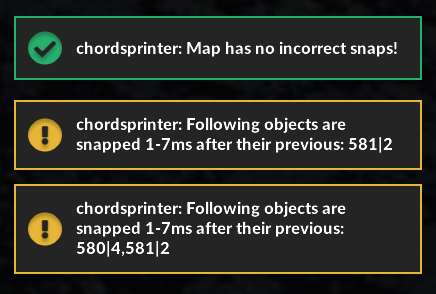

# chordsprinter

Basic snap linter for Quaver in the form of an editor plugin.

Enable the plugin to automatically give warnings and copy the offending notes into your clipboard, which can be used in Tools > Locate Objects, or in a mod. You do not need to disable and re-enable the plugin, it will recompute the map every time a note's timestamp changes, or a note gets added or removed.

The range to check is configurable on `config.yaml`.

